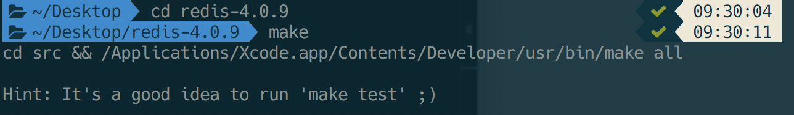
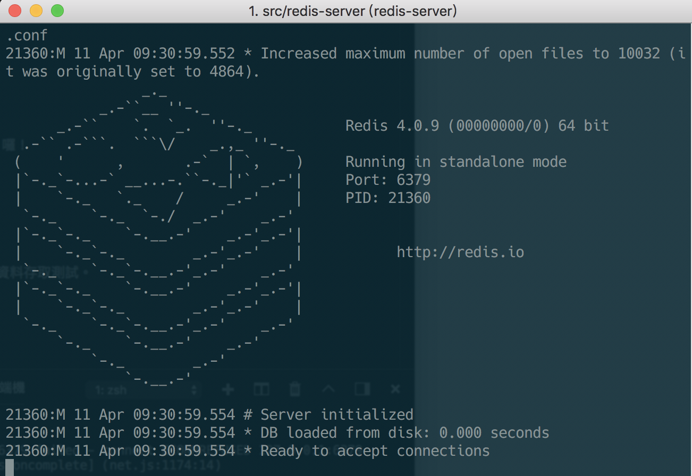
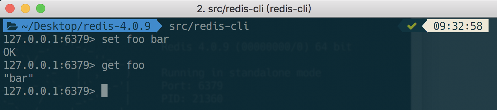
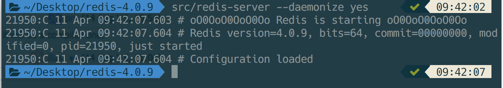
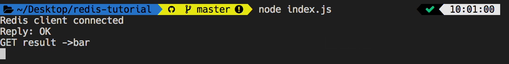

[![GitHub license][license-image]][license-url]

## 什麼是 Redis？
Redis 是一種內存資料庫(in-memory)的架構，可以被當作一個簡易的資料庫(key-value database)，這功能就讓我想起 Android 的 Shared Preferences 一樣是可以將資料存在用戶自己的裝置中，也等同於網頁中的 cookie、localStorage，Redis 使用 RAM 來存取資料所以相對來得快速，缺點是重開機後記憶體就會被釋放掉，但  Redis 有個功能 persistence 可以解決這個問題，此外 Redis 也能設定資料的生命週期(Expire)當你在儲存資料的時候，你可以新增一個 Expire time 的參數，時間一到之後，這個 key 就會自動被清除。

## 安裝 Redis
在應用 Node.js 前必須要先安裝 Redis 並啟動 Redis Server，首先到 [Redis官網](https://redis.io/download) 下載並解壓縮。

解壓縮完畢請進入到該目錄資料夾(我目前版本是 4.0.9)，並輸入 `make`，系統會自動幫你編譯產出 `redis-server` 與 `redis-cli`。

```bash
$ cd redis-4.0.9
$ make
```



### 啟動 redis-server
完後後就可以啟動 redis server 囉！啟動後你會發現他會開啟預設 6379 PORT。

```bash
$ src/redis-server
```



## 使用 redis-cli 執行
然而官方也提供 CLI 介面讓我們做資料存取測試，(請先執行好redis server並在新開一個終端機進入 redis-cli)。

```bash
$ src/redis-cli
redis> set foo bar
OK
redis> get foo
"bar"
```



## 使 redis-server 背景執行
你有沒發現上面教學要使用兩個終端機，而 redis server 卻佔用在桌面，這邊就教你如何使 redis server 背景執行，類似於 Node.js 中的 forever。

```bash
$ src/redis-server --daemonize yes
```



若要移除背景執行輸入以下指令就會幫你本機上所執行的排程清空：
```bash
$ pkill -u $USER redis-server
```

## 在 Node.js 中使用 Redis

### 建立資料夾
首先建立一個資料夾並進入該資料夾目錄中。

> 文章最後有提供 Git 原始碼下載

```bash
$ mkdir resis-tutorial
$ cd resis-tutorial
```

### 安裝 Redis 套件
使用 NPM 安裝 [Redis](https://www.npmjs.com/package/redis) 套件。

```bash
npm install redis --save
```

## 建立 `index.js`
在 [Redis](https://github.com/NodeRedis/node_redis) 的 GitHub 上有非常詳細的使用教學，我這邊直接複製上面並稍做修改。

```js
const redis = require('redis');
const client = redis.createClient(); // this creates a new client

client.on('connect', () => {
  console.log('Redis client connected');
});
client.set('foo', 'bar', redis.print);
client.get('foo', (error, result) => {
  if (error) {
    console.log(error);
    throw error;
  }
  console.log('GET result ->' + result);
});
```

## 執行
在終端端機上執行程式並會看到結果：

```bash
$ node index.js
```




## 小結
這篇教學主要是帶各位快速上手 Redis 有興趣可以深入詳讀官方文件，裡面有提供非常多的功能，有興趣可以來玩玩看～

範例程式碼：https://github.com/1010code/redis-tutorial

參考：https://hackernoon.com/using-redis-with-node-js-8d87a48c5dd7
https://stackoverflow.com/questions/14816892/how-to-keep-redis-server-running
https://community.webfaction.com/questions/6029/run-redis-in-background


[license-image]: https://img.shields.io/badge/license-MIT-blue.svg
[license-url]: https://github.com/1010code/redis-tutorial/blob/master/LICENSE
